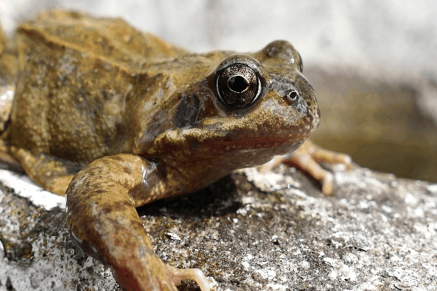

# Reangle-A-Video: 4D Video Generation as Video-to-Video Translation (ICCV 2025)
This repository is the official implementation of [Reangle-A-Video](https://arxiv.org/abs/2503.09151).<br>

[](https://hyeonho99.github.io/reangle-a-video/)
[](https://arxiv.org/abs/2503.09151)


## Abstract
**Reangle-A-Video**: A unified framework for synchronized multi-view video generation from a single monocular video, *without relying on any multi-view generative prior*

<details><summary>Full abstract</summary>


> We introduce Reangle-A-Video, a unified framework for generating synchronized multi-view videos from a single input video. Unlike mainstream approaches that train multi-view video diffusion models on large-scale 4D datasets, our method reframes the multi-view video generation task as video-to-videos translation, leveraging publicly available image and video diffusion priors. In essence, Reangle-A-Video operates in two stages. (1) Multi-View Motion Learning: An image-to-video diffusion transformer is synchronously fine-tuned in a self-supervised manner to distill view-invariant motion from a set of warped videos. (2) Multi-View Consistent Image-to-Images Translation: The first frame of the input video is warped and inpainted into various camera perspectives under an inference-time cross-view consistency guidance using DUSt3R, generating multi-view consistent starting images. Extensive experiments on static view transport and dynamic camera control show that Reangle-A-Video surpasses existing methods, establishing a new solution for multi-view video generation.
</details>


## Gallery

<table class="center">
<tr>
  <td style="text-align:center; width=200;"><b>Input video</b></td>
  <td style="text-align:center; width=200;"><b>Generated video1</b></td>
  <td style="text-align:center; width=200;"><b>Generated video2</b></td>
  <td style="text-align:center; width=200;"><b>Generated video3</b></td>
</tr>

<tr>
    <td style="width:200px;">
      
    </td>
    <td style="width:200px;">
      
    </td>
    <td style="width:200px;">
      
    </td>
    <td style="width:200px;">
      
    </td>
  </tr>

<tr>
    <td style="width:200px;">
      
    </td>
    <td style="width:200px;">
      
    </td>
    <td style="width:200px;">
      
    </td>
    <td style="width:200px;">
      
    </td>
  </tr>

<tr>
    <td style="width:200px;">
      
    </td>
    <td style="width:200px;">
      
    </td>
    <td style="width:200px;">
      
    </td>
    <td style="width:200px;">
      
    </td>
  </tr>

<tr>
    <td style="width:200px;">
      
    </td>
    <td style="width:200px;">
      
    </td>
    <td style="width:200px;">
      
    </td>
    <td style="width:200px;">
      
    </td>
  </tr>
  
</table>

## Setup
### 1. Install Conda Environment
```
git clone https://github.com/HyeonHo99/Reangle-Video
cd Reangle-Video
conda create -n reangle-video python=3.10
conda activate reangle-video
pip install -r requirements.txt
```

### 2. Install Depth-Anything-V2
```
git clone https://github.com/DepthAnything/Depth-Anything-V2.git extern/Depth-Anything-V2
mkdir -p extern/Depth-Anything-V2/checkpoints && wget -P extern/Depth-Anything-V2/checkpoints https://huggingface.co/depth-anything/Depth-Anything-V2-Large/resolve/main/depth_anything_v2_vitl.pth?download=true -O extern/Depth-Anything-V2/checkpoints/depth_anything_v2_vitl.pth
mv -f assets/temp/run.py extern/Depth-Anything-V2/run.py && mv -f assets/temp/dpt.py extern/Depth-Anything-V2/depth_anything_v2/dpt.py
```
## Finetune & Inference (Dynamic Camera Control)
### 1. Put your input video frames in 'data' folder like this: ```data/{VIDEONAME}/video```. 
- For example, we have a sample frog video in ```data/frog/video```.
- We assume that the number of frames is 49 as default.
- The num_frames (F) can be changed but it should be F=1+4\*f.

   
### 2. Estimate depth of the input video using Depth-Anything-V2:
- Put your 'VIDEONAME' instead of 'frog'
```
python extern/Depth-Anything-V2/run.py --encoder vitl --img-path data/frog/video --outdir data/frog/depth
```

### 3. Generate a set of warped videos
- These warped videos, along with the original input video, will be used for for finetuning (overfitting) the pretrained CogVideoX-I2V on a specific 4D scence.
- Note that only valid (visible) pixels within the warped videos will be used for the finetuning.
- Note that currently only these 6 camera motion types are implemented: ```'left' (orbit left), 'right' (orbit right), 'up' (orbit up), 'down' (orbit down), zoomin, zoomout```
  

#### Option 1: Warp
- Put your 'VIDEONAME' instead of 'frog'
- Adjust ```--camera_motion``` and ```--deg_pf``` on your needs. (```--deg_pf``` denotes degree per frame)
```
# to generate a warped video where camera gradually moves to orbit left with degree per frame 0.2
python warp_video_dcc.py --video_folder data/frog/video --depth_folder data/frog/depth --output_folder training-data/frog --deg_pf 0.2 --camera_motion left --num_frames 49

# to generate a warped video where camera gradually moves to orbit right with degree per frame 0.2
python warp_video_dcc.py --video_folder data/frog/video --depth_folder data/frog/depth --output_folder training-data/frog --deg_pf 0.2 --camera_motion right --num_frames 49

python warp_video_dcc.py --video_folder data/frog/video --depth_folder data/frog/depth --output_folder training-data/frog --deg_pf 0.2 --camera_motion up --num_frames 49
python warp_video_dcc.py --video_folder data/frog/video --depth_folder data/frog/depth --output_folder training-data/frog --deg_pf 0.1 --camera_motion down --num_frames 49
python warp_video_dcc.py --video_folder data/frog/video --depth_folder data/frog/depth --output_folder training-data/frog --deg_pf 0.4 --camera_motion zoomin --num_frames 49
python warp_video_dcc.py --video_folder data/frog/video --depth_folder data/frog/depth --output_folder training-data/frog --deg_pf 0.1 --camera_motion zoomout --num_frames 49
```
For example, above commandlines will generate these videos, respectively:
<table class="center">
<tr>
  <td style="text-align:center; width=200;"><b>left 0.2</b></td>
  <td style="text-align:center; width=200;"><b>right 0.2 </b></td>
  <td style="text-align:center; width=200;"><b>up 0.2</b></td>
  <td style="text-align:center; width=200;"><b>down 0.1</b></td>
  <td style="text-align:center; width=200;"><b>zoomin 0.4</b></td>
  <td style="text-align:center; width=200;"><b>zoomout 0.1</b></td>
</tr>

<tr>
    <td style="width:200px;">
      
    </td>
    <td style="width:200px;">
      
    </td>
    <td style="width:200px;">
      
    </td>
    <td style="width:200px;">
      
    </td>
    <td style="width:200px;">
      
    </td>
    <td style="width:200px;">
      
    </td>
</tr>
  
</table>

#### Option 2: Warp & Infill 
- Warp + Infill the missing pixels (nearest neighbor infilling; inspired by [DDVM](https://diffusion-vision.github.io/)) to minimize train-inference gap (reduce inevitable artifacts)
```
python warp_video_dcc_infill.py --video_folder data/frog_infill/video --depth_folder data/frog_infill/depth --output_folder training-data/frog_infill --deg_pf 0.2 --camera_motion left --num_frames 49
python warp_video_dcc_infill.py --video_folder data/frog_infill/video --depth_folder data/frog_infill/depth --output_folder training-data/frog_infill --deg_pf 0.2 --camera_motion right --num_frames 49
python warp_video_dcc_infill.py --video_folder data/frog_infill/video --depth_folder data/frog_infill/depth --output_folder training-data/frog_infill --deg_pf 0.2 --camera_motion up --num_frames 49
python warp_video_dcc_infill.py --video_folder data/frog_infill/video --depth_folder data/frog_infill/depth --output_folder training-data/frog_infill --deg_pf 0.1 --camera_motion down --num_frames 49
python warp_video_dcc_infill.py --video_folder data/frog_infill/video --depth_folder data/frog_infill/depth --output_folder training-data/frog_infill --deg_pf 0.4 --camera_motion zoomin --num_frames 49
python warp_video_dcc_infill.py --video_folder data/frog_infill/video --depth_folder data/frog_infill/depth --output_folder training-data/frog_infill --deg_pf 0.1 --camera_motion zoomout --num_frames 49
```
For example, above commandlines will generate these videos, respectively:
<table class="center">
<tr>
  <td style="text-align:center; width=200;"><b>left 0.2</b></td>
  <td style="text-align:center; width=200;"><b>right 0.2 </b></td>
  <td style="text-align:center; width=200;"><b>up 0.2</b></td>
  <td style="text-align:center; width=200;"><b>down 0.1</b></td>
  <td style="text-align:center; width=200;"><b>zoomin 0.4</b></td>
  <td style="text-align:center; width=200;"><b>zoomout 0.1</b></td>
</tr>

<tr>
    <td style="width:200px;">
      
    </td>
    <td style="width:200px;">
      
    </td>
    <td style="width:200px;">
      
    </td>
    <td style="width:200px;">
      
    </td>
    <td style="width:200px;">
      
    </td>
    <td style="width:200px;">
      
    </td>
</tr>
  
</table>

### 4. Make a training config file for CogVideoX finetuning
- ```make_training_config.py``` automatically generates the training config file.
- Put your 'VIDEONAME' instead of 'frog' and Put corresponding text prompt to the ```--original_prompt```
```
python make_training_config.py --training_data_dir "training-data/frog" --original_data_dir "data/frog" --original_prompt "a brown frog is sitting on a rock" --training_config_dir "training-configs/frog"
```

### 5. Run finetuning with inference
Modify variables in finetune.sh, specifically:
- Current script assumes a single GPU. If more GPUs are available, check out L8~L25.
- Put your 'VIDEONAME' instead of 'frog' in ```CAPTION_COLUMN, VIDEO_COLUMN, MASK_COLUMN, VALIDATION_IMAGES_DIR, output_dir``` (L37~L41).
- Put the correct text prompt (e.g., ```--original_prompt``` from above) in ```--validation_prompt``` (L62).
- If your GPU has 40GB VRAM, keep ```--gradient_checkpointing```. If your GPU has 80GB VRAM, remove ```--gradient_checkpointing```; this significantly slows down gradient backprop.

Then, run 
```
sh finetune.sh
```
  

## All the codes will be released soon!
- [x] Release code for Dynamic camera control
- [ ] Release code for Static view transport

## Acknowledgements and Related Works
- This project builds upon several excellent open source projects: [CogVideoX](https://huggingface.co/THUDM/CogVideoX-5b-I2V), [finetrainers](https://github.com/a-r-r-o-w/finetrainers)
- Related works that also enables reangling over an user input video: [GCD](https://gcd.cs.columbia.edu/) (ECCV'24), [NVS-Solver](https://github.com/ZHU-Zhiyu/NVS_Solver) (ICLR'25), [TrajectoryAttention](https://xizaoqu.github.io/trajattn/) (ICLR'25), [Recapture](https://generative-video-camera-controls.github.io/) (CVPR'25), [GS-DiT](https://wkbian.github.io/Projects/GS-DiT/) (CVPR'25), [TrajectoryCrafter](https://trajectorycrafter.github.io/) (ICCV'25), [ReCamMaster](https://jianhongbai.github.io/ReCamMaster/) (ICCV'25), ...
